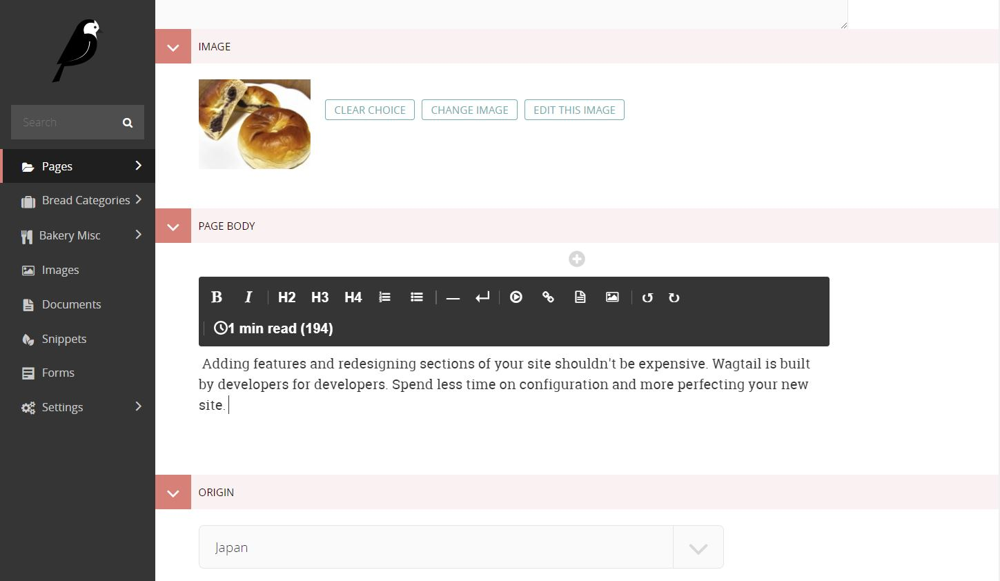

# Wagtail Draftjs Reading Time

An example implementation of the [draftail reading time component](https://github.com/springload/draftail/blob/master/examples/components/ReadingTime.js) using draftail's registerControl function.

!! This is an experimental build meant to test yet unreleased api features in Wagtail. !!



## Installation
- ```pip install wagtail-readingtime```
- Add 'readingtime' to your list of installed apps AFTER all wagtail app includes (e.g. wagtail.admin, wagtail.core etc). 
  
## Usage
Once installed You will see the reading time calculation displayed in the toolbar of all rich text fields in your Wagtail admin area.